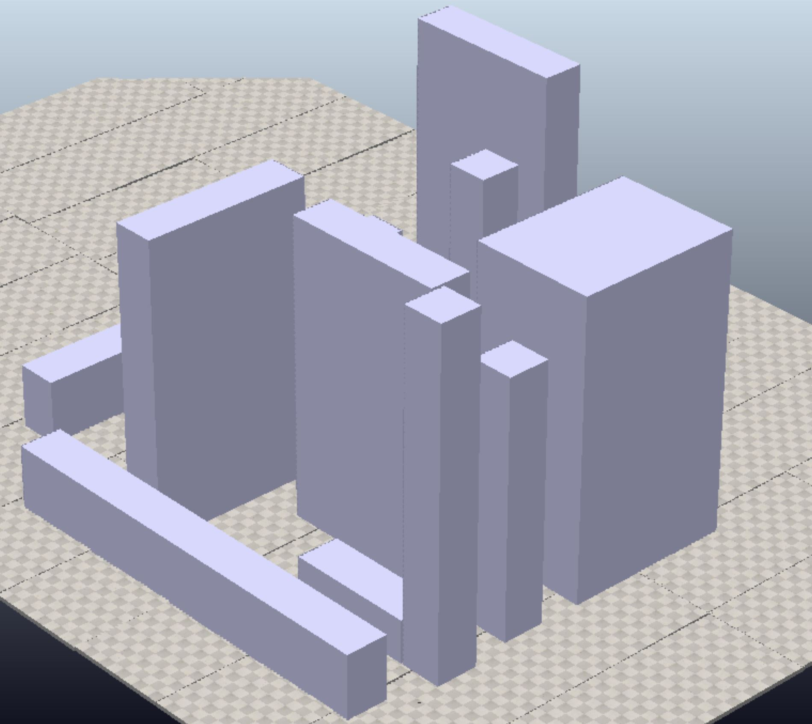
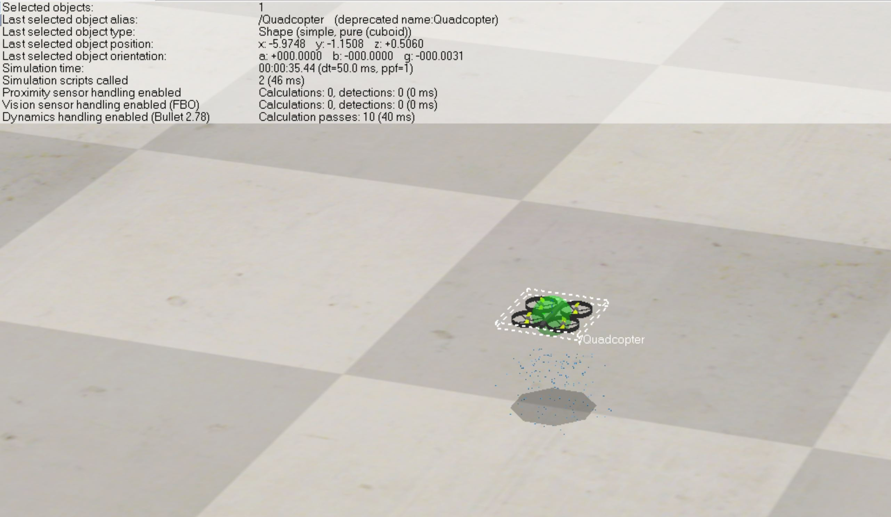

# Drone Delivery Path Planning Algorithm and Simulation

This repository was created for the RO47006 Planning & Decision Making course 2022/23 at the TU Delft by D. Janssen, T. Lukassen, G. Strunck and C. Wiers. It shows an approach of using an RRT* path planning algorithm to decide on a path for a package delivery drone in a city. For simulation CoppeliaSim has been used to create the city environment, providing a map for the planner to generate a path. The quadcopter is follow the generated path with a PD controller.

The RRT and RRT* path planning algorithms are highly inspired by https://github.com/AtsushiSakai/PythonRobotics/blob/master/PathPlanning/RRT/rrt.py and https://github.com/AtsushiSakai/PythonRobotics/blob/master/PathPlanning/RRTStar/rrt_star.py. The code in both these scripts is adjusted to make it work for a 3D path planning problem. 

## Table of Contents

- [Requirements](#requirements)
- [Setup](#setup)
- [How to Use](#howto)

## Requirements

The code was developed in ```python 3.6```.
To run the planner the following packages need to be installed and sourced in your environment:

- ```numpy```
- ```math```
- ```gym```
- ```matplotlib```
- ```csv```

The packages to use coppelia sim are:
- ```pyzmq```
- ```cbor```

To install missing packages use ```pip install:```
for the packages necessary for coppelia sim one can use:
```
$ /path/to/python_env -m pip install pyzmq
$ /path/to/python_env -m pip install cbor
```
> Note: Replace the `</path/to/python_env>` with your path to the python environment or have it activated

To connect remotely to the Coppelia simulation use of the [ZeroMQ remote API](https://github.com/CoppeliaRobotics/zmqRemoteApi) was made. For that the [zmqRemoteApi folder](/zmqRemoteApi/) has been included in this repository. Alternatively it can be downloaded from [this repository](https://github.com/CoppeliaRobotics/zmqRemoteApi/tree/master/clients/python).

For the simulation ```Coppelia 4.4.0 2022``` has been used. To install it please follow the instructions on their [CoppeliaSim downloads website](https://www.coppeliarobotics.com/downloads).


## How to simulate a path using Coppelia Sim.

The planner and the simulation have been kept separate for modularity and time savings. 

To initialize the simulation in Coppelia first open the [```quadcopter_city_environment.ttt```](/quadcopter_city_environment.ttt). Once the window opens and shows the city scene including the drone the simulation can be started by running the [```sim_main.py```](/my_main.py) script. 

<center>

</center>

This will first export the [obstacle bounding box map](/bboxes_objects.csv) and the [obstacle center location map](/center_positions_objects.csv). Then it will read the path generated by the RRT* planner from [```coppelia_path.csv.csv```](/coppelia_path.csv.csv) and fly the route in the CoppeliaSim city environment.

To use other environments, use the different .ttt files in the [```sim_main.py```](/my_main.py) script.

<center>

</center>
> Note that the quadcopter is very small compared to the buildings.


## How to find a path in the Coppelia environment using the Path planning Algorithm
This repository uses either a RRT or RRT* algorithm to find a global path, and a PD controller as a local planner to follow this global path. 
This  can all be accessed in the [```planning_main.py```](/planning_main.py) file. The [```planning_main.py```](/planning_main.py) file needs the  [obstacle bounding box map](/bboxes_objects.csv) and [obstacle center location map](/center_positions_objects.csv) files to define an environment. This file then follows a couple of different steps to generate a global path and a drone trajectory that followed the global path using the PD controller. First these steps are explained and then three different scripts that do the global path planning are explained, these are the [```planning_paths.py ```](/planning_paths.py ) script, the [```rrt_3D.py ```](/rrt_3D.py ) script and the [```rrt_star_3D.py ```](/rrt_star_3D.py ) script

1. First the find_path_rrt_star() function is called to generate a global path. This function is defined in the [```planning_paths.py ```](/planning_paths.py ) script. It uses either the [```rrt_3D.py ```](/rrt_3D.py ) or the [```rrt_star_3D.py ```](/rrt_star_3D.py ) scripts depending on which method is called. This method can be set in the [```planning_main.py```](/planning_main.py) file.
2. The remove_sharp_angles() function from the [```planning_paths.py ```](/planning_paths.py) is called to smoothen the global path found by the RRT algorithm.
3. This smooth path is then used by the PD controller which is simulated in a gym environment. In this simulation it uses functions from both the  [```controller.py ```](/controller.py) and the [```quadrotor.py ```](/quadrotor.py) scripts. 
4. When the simulation is completed a csv file [```coppelia_path.csv.csv```](/coppelia_path.csv) of the path that was executed by the drone using the PD controller is exported and a plot of the path is generated. 

#### the planning_paths.py script
The [```planning_paths.py ```](/planning_paths.py) script contains two different types of functions. Firstly it contains the functions that generate the global path. Here find_path_rrt_star() is the function that eventually outputs this path. In this functionsalso the settings for the global path algorithms can be set. Secondly it contains the functions that are needed to define the desired trajectory (containing both position and a certain velocity) at each timestep for the PD controller to be simulated. The rrtstar_path_state() outputs the desired state that is used in the drone simulation with the PD controller.

#### the rrt_3D.py and rrt_star_3D scripts
The [```rrt_3D.py ```](/rrt_3D.py ) and  [```rrt_star_3D.py ```](/rrt_star_3D.py ) script both contain a class that is able to generate a path according to either the RRT or the RRT* algorithm. Both these scripts contains a main file where a environment is defined. This can be used to run the scripts seperatly from the other scripts. script for the RRT* algorithm needs the [```rrt_3D.py ```](/rrt_3D.py ) file in the same folder. It uses allot of code from this script. 
